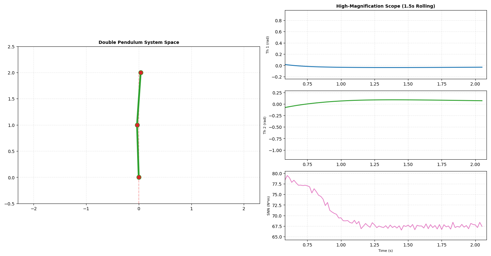
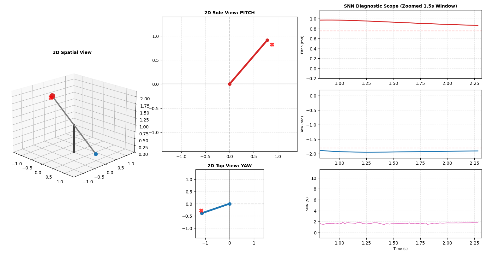
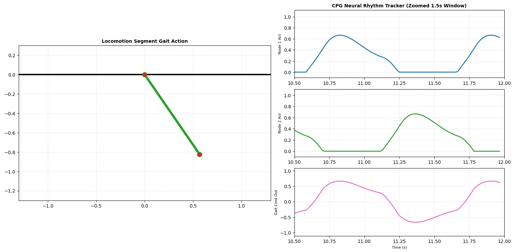

# FORCE-SNN Control Systems

A collection of closed-loop neuromorphic control systems using Spiking Neural Networks (SNNs) trained online via the FORCE learning algorithm (Recursive Least Squares) and structural biomimetic loops. All modules feature a unified 4-panel runtime diagnostic interface containing a live physical animation step coupled directly with a high-magnification rolling 1.5s telemetry window.

---

## Core Theoretical Concepts

### 1. Liquid State Machines & Reservoir Computing
Instead of training the recurrent connections of a deep network, these loops use a fixed, high-dimensional spiking reservoir. States are mapped into high-density neural currents via population-coded Gaussian tuning vectors. The reservoir generates multi-variable transient firing profiles that act as a spatio-temporal memory interface containing explicit mechanical trajectory history.

### 2. High-Frequency Online FORCE Learning
Readout tracking updates execute within high-frequency physics sub-stepping loops (1500 Hz) to clear phase lags. Output weights are tuned online via Recursive Least Squares (RLS):

$$e(t) = W_{\text{out}} \cdot r(t) - f_{\text{teacher}}(t)$$

$$P(t) = P(t-\Delta t) - \frac{P(t-\Delta t) \cdot r(t) \cdot r^T(t) \cdot P(t-\Delta t)}{1 + r^T(t) \cdot P(t-\Delta t)}$$

$$W_{\text{out}}(t) = W_{\text{out}}(t-\Delta t) - P(t) \cdot r(t) \cdot e(t)$$

---

## Repository Architecture

### Core Control Closures
* `rail-based-stabilizer.py`: Underactuated cart-pole tracking loop incorporating an equilibrium state-space freeze lock ($\lvert\theta\rvert < 0.015\text{ rad}$).

* `rotary-stabilizer.py`: Chaotic two-link double pendulum system stabilized via continuous RK4 physics integration synced directly with spiking neural timelines.
  
  <p align="center">
    
  </p>

* `twin-rotor.py`: Multiple-Input Multiple-Output (MIMO) desktop helicopter system using an SNN decoupler shield to cancel gyroscopic horizontal cross-coupling vectors.
  
  <p align="center">
    
  </p>

### Foundational & Biomimetic Extensions
* `spiking-neurons.py`: Comparative benchmark loop plotting comparative transient electrical parameters across LIF and Izhikevich neural nodes under constant injected current.

* `pattern-gen.py`: Biomimetic locomotion model demonstrating how an un-encoded recurrent neural structure (Matsuoka Central Pattern Generator) can generate autonomous, high-frequency rhythmic gaits to drive robotic limbs.
  
  <p align="center">
    
  </p>

---

## Quick Start

### Dependencies
```bash
pip install numpy matplotlib

```

### Execution

```bash
python twin-rotor.py

```
